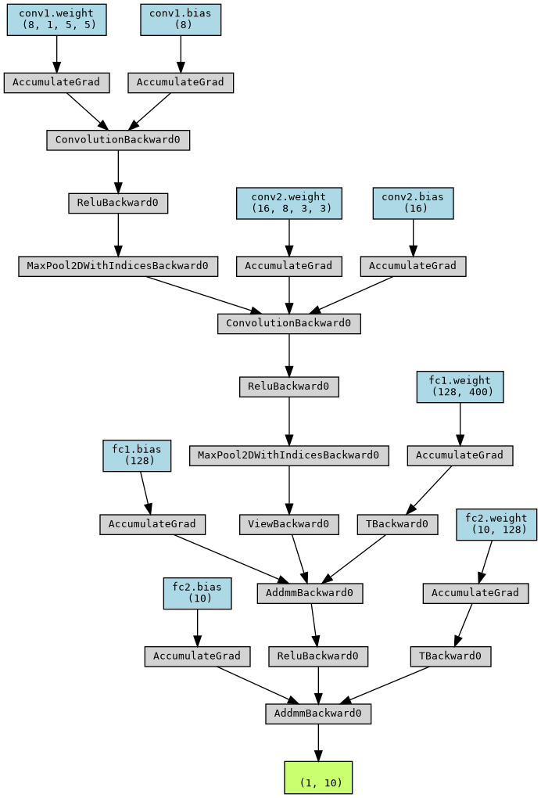

# MNIST Digit Classification with PyTorch

This project demonstrates training a simple neural network to classify handwritten digits from the MNIST dataset using PyTorch.

## Project Structure
- `notebook_mnist.ipynb`: Main Jupyter notebook for data loading, model definition, training, evaluation, and loss plotting.
- `requirements.txt`: List of required Python packages.
- `data/`: Directory containing the MNIST dataset.

## How to Run
1. Install dependencies:
   ```bash
   pip install -r requirements.txt
   ```
2. Open `notebook_mnist.ipynb` in Jupyter or VS Code.
3. Run the cells sequentially to:
   - Download and visualize the MNIST data
   - Define and train a neural network
   - Plot the training loss
   - Evaluate model accuracy on the test set
   - Visualize the model architecture

## Features
- Loads and visualizes MNIST data
- Defines a simple CNN for digit classification
- Trains the model and plots the loss curve
- Evaluates accuracy on the test set
- Visualizes the model architecture

## Model Architecture Visualization
Below is the architecture of the CNN model used in this project:



---


